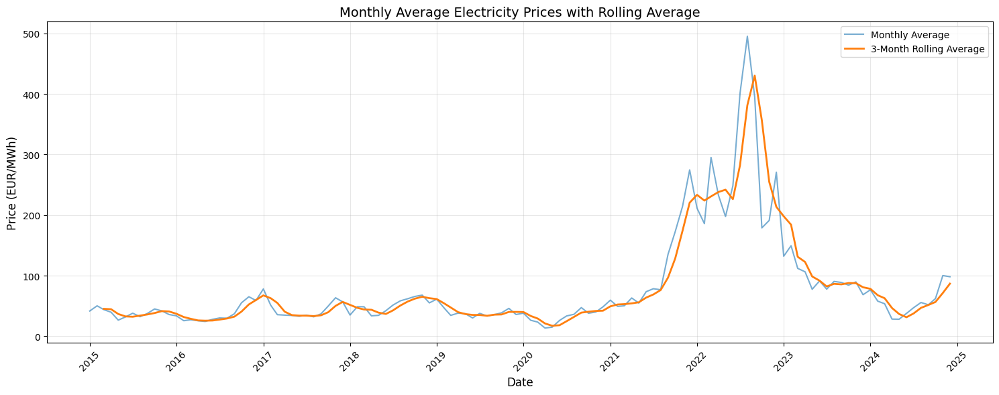

# XG Boost with lag hours of 3 days (25 - 96)

rmse = 14
mae = 7.3

13/08/2025
- V1 dataset created with only FR data

DatetimeIndex: 68864 entries, 2015-01-09 00:00:00+01:00 to 2024-12-31 23:00:00+01:00
Data columns (total 84 columns):
 #   Column            Non-Null Count  Dtype  
---  ------            --------------  -----  
 0   FR_Solar          68864 non-null  float64
 1   FR_Wind Offshore  68864 non-null  float64
 2   FR_Wind Onshore   68864 non-null  float64
 3   FR_forecast_load  68864 non-null  float64
 4   FR_price          68864 non-null  float64
 5   Day_sin           68864 non-null  float64
 6   Day_cos           68864 non-null  float64
 7   Year_sin          68864 non-null  float64
 8   Year_cos          68864 non-null  float64
 9   EUA_EUR           68864 non-null  float64
 10  TTF_EUR           68864 non-null  float64
 11  ARA_EUR           68864 non-null  float64
 12  price_lag_25h     68864 non-null  float64
 ...
  83  price_lag_96h     68864 non-null  float64

  
  16/08/2025
  The MPL model does not manage to generalize, the gap between training and validation loss remains very high, whatever regularization, dropout or simple model I use.
  This could be due to a lack of data in the past to forecast the future.

  Indeed the val set was composed of prices from 2021 to 2023 which were much higher than usual. So I removed month with 3-months-rolling average above 100 €/MWh. And now the model generalizes much better.

Final Training Metrics:
RMSE: 11.5553
['mae']: [6.47]

Final Validation Metrics:
RMSE: 19.0647
['mae']: [13.6979]

  Fuel prices were not included, they were removed in the method create_features. Results largely improved when they are included, see below.

Final Training Metrics:
RMSE: 10.5284
['mae']: [5.301108360290527]

Final Validation Metrics:
RMSE: 15.6954
['mae']: [10.463689804077148]

  17/08/2025
  Added crossborder flows from ENTSO-E

  The next dataset should contrain crossborder flows
  